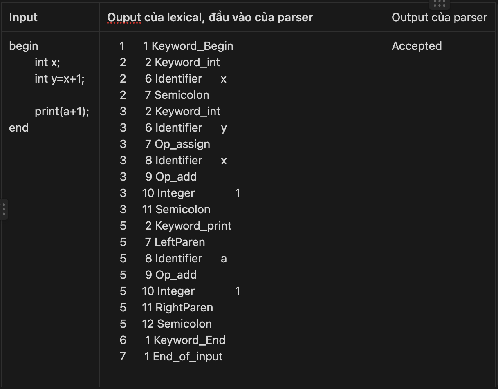
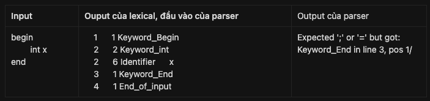

# README

## 1. Thành viên nhóm

| STT | Họ và tên      | Mã sinh viên |
|-----|----------------|--------------|
| 1   | Cung Văn Thắng | 21020939     |
| 2   | Phạm Tuấn Anh  | 20020631     |
| 3   | Lê Ngọc Ánh    | 20020166     |

## 2. Văn phạm phi ngữ cảnh

Sau khi đã giảm đệ quy trái, left factoring

```bash
Program          -> 'begin' StatementList 'end'
StatementList    -> Statement ';' StatementList | ε
Statement        -> Declaration | Assignment | ConditionalStatement | LoopStatement | PrintStatement
Declaration      -> Type Delcartion'
Decalration'     -> Identifier | Identifier '=' Expression
Assignment       -> Identifier '=' Expression
Expression       -> Term, Expression'
Term             -> Factor, Term'
Factor           -> Identifier | Number | '(' Expression ')'
ConditionalStatement  -> 'if' ConditionalStatement'
ConditionalStatement' -> Expression 'then' '{' Statement '}' | Expression 'then' '{' Statement '}' 'else' '{' Statement '}'
LoopStatement    -> 'do' '{' Statement '}' while' Expression
PrintStatement   -> 'print' '(' Expression ')'
Type             -> int | bool
Expression' -> '+', Term, Expression' | ROP, Term, Expression' | ε
Term' -> '*', Factor, Term' | ε
```

## 3. Lexical analyzer

Nhận đầu vào là file cần phân tích từ vựng, chương trình ghi các token nhận biết được ra file “upl.lex” (sẽ sử dụng để
làm input của bộ parser)

```java
// VD: File file = new File("upl_java/main.upl");

private static void _lexicalAnalysis(File f) throws IOException {
    Scanner s = new Scanner(f);
    StringBuilder source = new StringBuilder(" ");
    while (s.hasNext()) {
        source.append(s.nextLine()).append("\n");
    }
    Lexical l = new Lexical(source.toString());
    l.printTokens(defaultOutputLexFilePath);
}
```

```java
public void printTokens(String outputLexFilePath) throws IOException {
    Token token;
    try (PrintWriter writer = new PrintWriter(new FileWriter(outputLexFilePath))) {
        while ((token = getToken()).tokentype != TokenType.End_of_input) {
            /// in ra file
            writer.println(token);
        }
        writer.println(token);
    }
}
```

Ouput của lexical sẽ bao gồm line, position, token.Xem các test case ở phía dưới để rõ hơn.

## 4. Parser

Nhận đầu vào là file upl.lex, xử lý và tạo list các token.

Function `parse()` bắt đầu bằng cách lấy token tiếp theo từ danh sách token. Nếu token đầu tiên không phải là từ khóa '
begin', chương trình sẽ báo lỗi và dừng. Nếu không, nó sẽ tiếp tục phân tích (parse) các câu lệnh cho đến khi nó gặp
token `End_of_input` (kết thúc đầu vào).

Chương trình sẽ in ra thông báo "ACCEPTED √" để biểu thị quá trình phân tích cú pháp đã thành công.

```java
void parse() {
    getNextToken();
    // Check for "begin" keyword
    if (this.token.tokentype != TokenType.Keyword_Begin) {
        ErrorHandler.error(this.token.line, this.token.pos, "Expected 'begin' keyword at the beginning of the program");
        return;
    }
    getNextToken();
    // Parse the statement
    while (this.token.tokentype != TokenType.End_of_input) {
        stmt();
    }
    // if pass all condition, print accepted
    System.out.println(ANSI_GREEN + "ACCEPTED √" + ANSI_RESET);
}
```

Chương trình xác định thứ tự ưu tiên của các toán tử trong một biểu thức. Điều này được thực hiện bằng cách gán một giá
trị `precedence` cho mỗi kiểu token. Giá trị này càng cao thì toán tử đó càng được ưu tiên. Ngoài ra, mỗi token cũng
được gán một giá trị boolean `is_binary` để xác định xem token đó có phải là toán tử nhị phân hay không.

```java
enum TokenType {
    /// `precedence` tỉ lệ thuận độ ưu tiên của phép toán trong biểu thức
    private final int precedence;

    /// xác định xem token đó có phải là toán tử nhị phân không
    private final boolean is_binary;
}
```

```java
Op_multiply( true,5),

Op_add(true,4),

Op_greater(true,3),

Op_greaterequal(true,3),

Op_equal( true,2),

Op_assign(false,-1),

LeftParen(false,6),

RightParen(false,6),
```

Cách sử dụng precedence

```java
// Nếu token hiện tại đang được nhận diện phép toán nhị phân và có quyền ưu tiên
// mức độ ưu tiên lớn hơn hoặc bằng 'độ ưu tiên' (mức độ ưu tiên hiện tại đang được xem xét -- precendence truyền vào),
// sẽ tiếp tục xử lý các phép toán nhị phân trong biểu thức.
while(this.token.tokentype.isBinary() &&this.token.tokentype.

getPrecedence() >=precedence){
// Store the current binary operation (token type)
op =this.token.tokentype;

// Move to the next token in the sequence
getNextToken();

// Determine the precedence of the current binary operation
q =op.

getPrecedence();

q++;

expr(q);
}
```

## 5. Test cases

Test case 1



Test case 2



## 6. Kết quả đạt được

- Bộ lexical và parser phân tích đúng từ vựng và cú pháp theo ngữ pháp.
- Đã in ra được vị trí lỗi, gợi ý cách sửa lỗi trong bộ Parser.